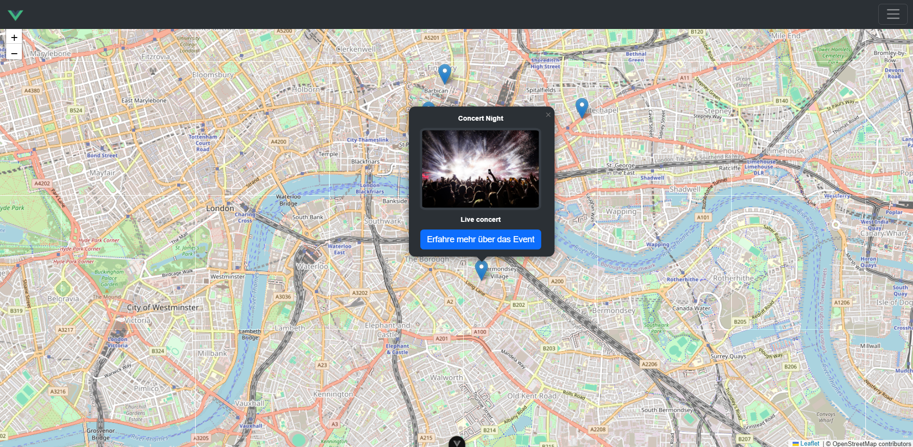

# Prototyp-Webanwendung – Bachelorarbeit

Diese Webanwendung ist ein **Prototyp**, der im Rahmen meiner [Bachelorarbeit](https://doi.org/10.60524/opus-2476) entwickelt wurde.  
Ein Teilziel der Arbeit war es, die **Softwarequalität** einer manuell von einem Softwareentwickler erstellten Webanwendung mit Webanwendungen zu vergleichen, 
die unter **denselben Anforderungen** von **drei unterschiedlichen KI-Tools** generiert wurden.

<div style="text-align: center; padding: 20px;">
    
</div>

## Funktionsbeschreibung
Der Prototyp ist eine **einfache interaktive Karte**, in der **Events erstellt und abgefragt** werden können.  
Dies umfasst unter anderem:
- Erstellung neuer Events mit Ortsangabe
- Darstellung der Events auf der Karte
- Abfrage und Filterung vorhandener Events

## Hintergrund
Im Zuge der Bachelorarbeit wurde dieser Prototyp als Referenz implementiert, um einen direkten Vergleich in Hinblick auf:
- Codequalität
- Performance
- Wartbarkeit
- Funktionale Vollständigkeit

durchführen zu können.

## Hinweise
- Dient ausschließlich zu Forschungs- und Analysezwecken.
- Die Ergebnisse und Analysen sind vollständig in der Bachelorarbeit dokumentiert.

## Anwendung starten

Um die Anwendung lokal auszuführen, müssen folgende Schritte getätigt werden:


   ```bash
   cd Backend
   npm install

   cd Interactive-Map
   npm install

   ./start.sh
   ```